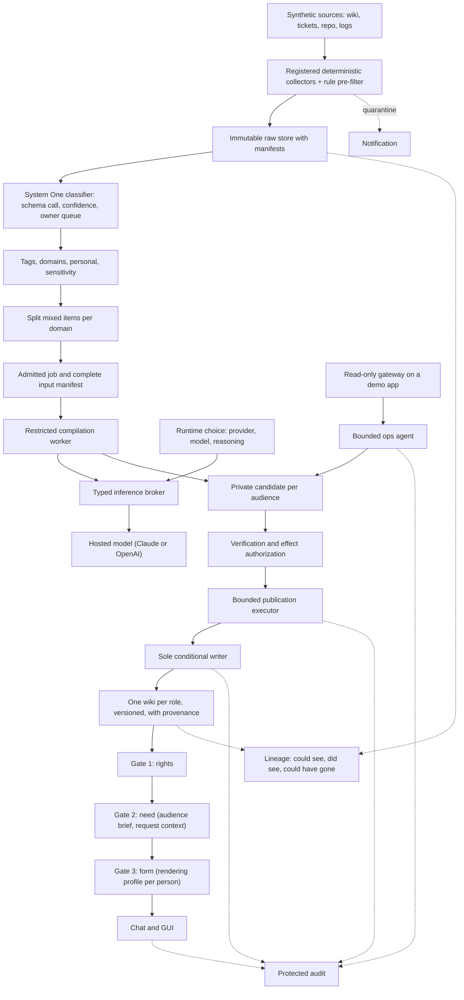

# kops

**Governed knowledge compilation and publishing, as a local demo you can run on any machine
with Docker.**

kops takes source material (wiki pages, tickets, repositories, logs), classifies it, compiles
it into knowledge pages for a specific audience, and serves it back through a chat and a GUI
under three separate gates: what the reader is entitled to, what the reader needs, and the
form the reader works best with. Every step is governed: sources are immutable and traced,
compilation goes through review and explicit authorization, publication has one writer, and
every attempt and outcome is in a protected audit.

This repository is a solo exploration by Franco Geraci. It is public so that the demo can be
cloned and run anywhere, and so that the reasoning behind each design choice is on record.
Everything in it is synthetic: the company, the people, the documents, the secrets planted on
purpose. Nothing here is a product, a certification or a claim of enterprise security.

## What the demo is meant to show

1. **Knowledge compiled from an immutable raw store.** Deterministic collectors fill a raw
   store; they never call a model and an unregistered collector cannot write. Every run leaves
   a manifest.
2. **Dangerous material never reaches a model or a wiki.** Deterministic rules quarantine
   credentials, card numbers and personal data before any model call, and a notification
   rings.
3. **Every item is classified with typed answers and a probability, not prose.** A small
   "System One" model answers a fixed question set per item (tags, domains, personal,
   sensitivity) with a confidence; uncertain items wait for their owner; an evaluation set
   scores every run.
4. **One wiki per audience, compiled through a review gate.** Supplier rates end up in the
   Finance wiki, the supplier profile in the Operations wiki, neither anywhere else.
5. **The return passes three separate gates.** Rights (role, domain, tag) is the only gate
   that refuses. Need (an audience brief per role) decides what is useful: a first-level
   helpdesk operator entitled to the architecture still gets the phone script, not the
   architecture. Form (a rendering profile per person) decides how it reads. Need and form never
   widen what rights allowed.
6. **The form adapts to the person without changing the substance.** The rendering profile is a
   structured, visible, editable record: length, what to lead with, format, tone, words to
   avoid, the person's own words. Two people with the same role get the same pages in different
   form.
7. **Live truth through a read-only gateway, and an agent inside its budget.** Typed
   operations on a demo application, refusals at both ends, an operations agent that reports a
   failing check within its call and time budget without trying to fix it.
8. **Lineage.** For any raw item: who could have seen it and when, who did, where it could have
   gone, including agents.
9. **Machine independence and the model as a runtime choice.** The Compose stack runs unchanged
   on Linux, Windows and macOS. Provider (Claude or OpenAI), model and reasoning effort are
   chosen per session, never hard-wired, and recorded on every output.

The first delivery (points 4, part of 5, and the governance around review, publication,
revocation and audit) is implemented and documented in [docs/evidence](docs/evidence/). The
rest is the lab stage planned in [docs/lab.md](docs/lab.md) and assigned in
[HANDOFF.md](HANDOFF.md). The status line of each document says which is which.

## Architecture



The worker proposes content. The application decides what may be read, who may authorize the
result and whether publication can commit. A source document, a generated page or a model
answer cannot grant permissions.

Two models play different parts. **System One** is a small, cheap model called with a JSON
schema and a fixed question set; it classifies and never writes prose. **System Two** is the
model chosen for the session; it compiles pages and answers questions inside the review gate.
Both are hosted providers selected at runtime; there is no local inference in this demo.

The governance rules follow the C01 to C12 controls of
[The Agentic Pact](https://github.com/bitrockteam/the-agentic-pact). The
[implementation evidence](docs/evidence/implementation.md) records which controls were verified
in the first delivery and which remain partial or outside its scope.

## The synthetic world

`scripts/generate_meridian.py` generates `fixtures/meridian/` deterministically from a fixed
seed, with no model call: Meridian Ferries, a fictional ferry operator with five internal
systems; 15 people with rendering profiles; 8 roles with audience briefs; 6 domains; 35 tags;
19 wiki pages; 8 architecture decision records; 120 helpdesk tickets; 201 commits; 2,000 log
lines around one incident. Planted on purpose: a page with fake credentials and two tickets
with a fake card number and a password (must be quarantined), a personal on-call roster (must
be ingested as restricted and traced), three mixed pages (must be split per domain). Ground
truth for tags and for five demo questions lives in `fixtures/meridian/eval/`. Edit the
generator, regenerate, commit both; never hand-edit the output. Planted secrets are canonical
fake values.

## How the demo works

The GUI walks through the stages; each screen shows the selected persona, the intended
audience, the run, the permitted inputs, the current state and the evidence behind it.

```mermaid
flowchart LR
    SETUP["0. Model setup"] --> COLLECT["1. Collect and quarantine"]
    COLLECT --> CLASSIFY["2. Classify and label"]
    CLASSIFY --> ADMIT["3. Admission"]
    ADMIT --> COMPILE["4. Compile per audience"]
    COMPILE --> REVIEW["5. Review"]
    REVIEW --> PUBLISH["6. Publish"]
    PUBLISH --> ASK["7. Read and ask, three gates"]
    ASK --> LIVE["8. Live truth via gateway"]
    LIVE --> MAINTAIN["9. Maintain"]
    MAINTAIN --> REVOKE["10. Access changes"]
    REVOKE --> AUDIT["11. Audit and lineage"]
    MAINTAIN -->|New candidate| REVIEW
```



The story the demo tells:

1. Choose provider, model and reasoning. Nothing compiles without them.
2. Run the collectors. Three planted items are quarantined before any model sees them; the
   roster enters as restricted; every run has a manifest.
3. Classify. Every item gets typed answers with a confidence; the evaluation report scores the
   run; an uncertain item waits in the owner queue and the owner's decision becomes a label.
4. Compile one wiki per role. Mixed pages are split first. The candidate carries the full
   input manifest and the provider, model and reasoning that produced it.
5. Verify the exact candidate, then separately authorize its publication.
6. Publish through the sole writer, with expected versions and idempotency.
7. Ask the same question as five different people. The L1 operator gets a phone script, the
   ops desk a checklist, the developer a code path, the finance controller a 404. Two people
   with the same role get the same pages in different form.
8. Ask for the live state of the demo application. The gateway runs only typed read-only
   operations; a mutating request is refused at both ends and both refusals are in the audit.
9. Update a source, inspect stale dependencies and regenerate through the same gate.
10. Revoke a membership and see the denials on pages, history and saved answers.
11. Read the audit and the lineage of the roster: who could have seen it, who did, including
    the agent.

The persona selector is a presentation tool. One presenter switching roles does not establish
independent human review or real sign-in.

## Run it

Target experience on any machine with Docker (Linux, Windows or macOS):

```sh
git clone git@github.com:bitrockteam/kops.git
cd kops
git checkout dev
cp .env.example .env        # provider, model, reasoning, classifier model
docker compose up --build
```

Then put the provider API key in `.runtime/secrets/<provider>_api_key` (or paste it in the GUI
settings panel, which writes the same file) and open **http://127.0.0.1:8080**. The port is
`KOPS_PORT` in `.env`.

Until the lab phase P0 closes, the first delivery still uses `make setup` (Bash) to generate
per-service secrets and accepts only local model endpoints. If you run the current `main`, the
commands are `make setup`, `make up`, `make test`, `make down`, `make demo-reset`, `make
backup` and `make restore`; see [docs/plan.md](docs/plan.md) for their contract.

`docker compose --profile test` runs the automated lifecycle tests against a fixture model that
speaks the OpenAI-compatible shape. Fixture output is test-only and never counts as evidence.

## Configure the model at runtime

| Variable | Meaning |
|---|---|
| `KOPS_MODEL_PROVIDER` | `anthropic` or `openai`. Empty means the GUI shows the settings panel and refuses to compile. |
| `KOPS_MODEL_NAME` | The System Two model that compiles pages and answers questions. |
| `KOPS_CLASSIFIER_MODEL` | The System One model that classifies raw items; defaults to the provider's small model. |
| `KOPS_MODEL_REASONING` | `low`, `medium` or `high`, mapped to the provider's own parameter, ignored where a model has none. |

The API key is read from a secret file, never from `.env`, never committed. The allowlist of
model hosts holds exactly the two provider APIs; cloud metadata, link-local addresses and
redirects are denied. The model configuration is pinned to each job, so changing it does not
alter a run in progress. An unavailable model gives an explicit failed state, never a canned
answer. Provider, model and reasoning are recorded on every compiled page, answer and
classification, and the GUI shows them.

## Permissions and provenance

Action roles and content audiences are separate. Being a publisher does not grant access to
all sources. Being a member of two domains does not permit publishing one domain's material to
readers of the other.

| Layer | Authoritative content |
| --- | --- |
| Raw store | Immutable collected items, manifests, quarantine records. |
| Private content storage | Immutable source snapshots and Markdown page bodies. |
| PostgreSQL | Policies, memberships, tags, domains, roles, principals, rendering profiles, revisions, jobs, manifests, approvals, dependencies, publication references, lineage. |
| Publication service | The sole logical writer of visible page revisions, with expected versions and idempotency. |
| Protected audit service | Attributable operation attempts, decisions and outcomes, append-only. |
| GUI and chat | Views of authorized backend state; never an authority source. |

Every generated revision retains all admitted input dependencies. A citation links a claim to
evidence; the full manifest records what could have influenced the generation. Policy changes
affect dependent pages and saved answers. Current permissions apply to historical versions too.

Git versions the application, schemas, documentation and synthetic fixtures. Runtime data,
secrets and API keys stay private and ignored.

## Boundaries and limitations

- All documents, people, systems and secrets are synthetic.
- Identity is mocked; real SSO, MFA and directory synchronization are untested.
- The local host administrator is trusted. Container and database-role tests do not prove
  isolation from that administrator.
- A hosted model may still generate unsupported claims. Valid citations do not establish that
  the cited evidence supports a claim. That is why the review gate stays.
- The rendering profile is a structured record, not a learned model of a person.
- Part of the synthetic corpus is sent to a hosted provider for classification and
  compilation. Do not point this demo at data that must not leave your perimeter.
- Content already delivered as plaintext cannot be recalled.
- No production deployment, availability guarantee or enterprise certification is claimed.

## Repository guide

| File | Purpose |
| --- | --- |
| [Lab plan](docs/lab.md) | What the demo demonstrates, the classifier design, phases and gates, runtime contract. |
| [Handoff](HANDOFF.md) | The assignment for the implementing session: read order, rules, first actions, deliverables. |
| [First delivery plan](docs/plan.md) | Scope and milestones of the first delivery, merged at `4050225`. |
| [Architecture v4](docs/architecture-v4.md) | Architecture snapshot of the governed compilation component. |
| [GUI walkthrough](docs/gui-walkthrough.md) | Screens, actions and observable evidence of the first delivery. |
| [Acceptance matrix](docs/acceptance.md) | Positive, negative, fault and live-model scenarios. |
| [Status](docs/status.md) | Completed work, remaining work and the next action. |
| [Decisions](docs/decisions.md) | Scope decisions and their reasons. |
| [Evidence](docs/evidence/) | Tested commits, configurations and observed results, one file per delivery or phase. |
| [GUI screenshots](screenshots/README.md) | Firefox evidence from publication and access revocation. |
| [Project instructions](AGENTS.md) | Repository rules for any agent working here. |

Work happens on `dev` and moves to `main` when Franco says so. No feature branches, no pull
requests, no branch protection: this is a one-person exploration and the history says so.
