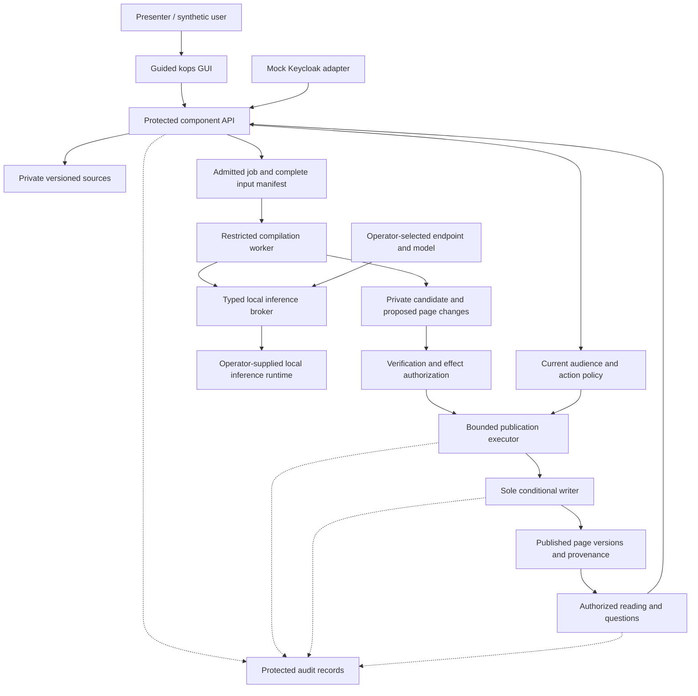
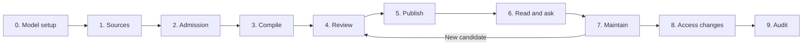

# kops

**Governed knowledge compilation and publishing for KnowledgeOps Platform.**

kops is a working local demo that turns approved source material into maintained, linked knowledge pages. Its guided GUI shows how source permissions, evidence, review and publication govern each change, and how access changes affect previously generated knowledge.

> **Repository status: implemented for local review.** Mock identity and deterministic fixture-inference tests are verified. A live-model acceptance run and independent human review remain operator-owned gates; no fixture result is presented as live model evidence.

## What the demo will let you do

- Explore a synthetic Engineering and Finance corpus.
- Select your local inference endpoint and model at runtime.
- Compile sources into private Markdown page proposals with links and evidence.
- Review the exact changes, then separately authorize their publication.
- Read authorized pages, follow their history and ask questions with citations.
- Update a source, inspect maintenance findings and regenerate affected pages.
- Revoke access and inspect the actual resulting denials and audit events.

Keycloak is mocked. Source storage, audience checks, provenance, review records, publication, revocation and audit are backend-enforced and persisted. Compilation and questions require a real operator-selected local model in normal use. No OpenSearch, embeddings, corporate connectors, real SSO, unattended refresh, MCP/A2A or cloud deployment is included.

## How it fits into KnowledgeOps Platform

kops represents the governed knowledge compilation and publishing component. It is not the entire platform. Shared identity, policy, model, storage and audit responsibilities are exposed through replaceable interfaces. The demo supplies local implementations and an explicit identity mock.



The worker proposes content. The application decides what may be read, who may authorize the result and whether publication can commit. A source document or generated page cannot grant permissions.

The implementation follows the C01-C12 governance rules defined in [The Agentic Pact](https://github.com/bitrockteam/the-agentic-pact). The [implementation evidence](docs/evidence/implementation.md) records which controls were verified in this local demo and which remain partial or outside its scope.

## Local run interface

Prerequisites for that delivery are Git, Make, Docker with Compose, and an operator-supplied local inference runtime for actual compilation and questions. Python is the application language; exact supported versions will be pinned and documented by the implementation. Model installation and weight downloads remain under operator control.

```sh
git clone git@github.com:bitrockteam/kops.git
cd kops
make setup
make up
```

The intended default GUI URL is **http://127.0.0.1:8080**. The implementation must print the actual URL and allow another port if it is occupied. The existing local checkout can be used directly; do not clone over it.

| Command | Required behavior |
| --- | --- |
| `make setup` | Validate Docker and Compose, generate ignored per-service local secrets and validate configuration. It does not download models or install an identity provider. |
| `make up` | Build and start PostgreSQL, the API, admitted-content broker, restricted worker, bounded publisher and protected audit collector; report the loopback GUI URL. |
| `make logs` | Display useful local service/job diagnostics without secrets. |
| `make test` | Run unit and full HTTP lifecycle tests in a separate disposable Compose project, then assert database privilege boundaries. The bundled inference double is test-only and is never a normal-runtime fallback. |
| `make down` | Stop all demo-managed processes. Leave persisted demo state intact. |
| `make demo-reset` | Ask for explicit confirmation, then remove only the synthetic demo's Compose volumes. Preserve independent acceptance evidence. |

`make backup` creates checksummed database and private-content archives below ignored `.runtime/backups`. `make restore BACKUP=.runtime/backups/<timestamp>` verifies checksums, asks for explicit confirmation and restores only the demo-managed database and content volumes.

Before the first model-backed run, open **Model Setup**. The rest of the interface should remain usable for fixture inspection and deterministic lifecycle checks if a model is unavailable.

## Configure the model at runtime

No endpoint or model is currently selected. The GUI must let the local operator:

1. Choose a local OpenAI-compatible or native Ollama adapter.
2. Enter the endpoint and select or enter the model name.
3. Test connectivity and supported behavior.
4. Set finite input, output, time and retry limits.
5. Save the configuration for subsequent jobs.

The model configuration is pinned to each job so changing the selection does not silently alter an in-progress run. An unavailable model results in an explicit blocked/failed state, never a canned answer or automatic hosted-provider fallback.

When the application runs in containers, `localhost` inside a container is not the host inference service. The delivered setup must provide and document an explicit container-to-host route, test it, and validate allowed destinations. Do not expose the inference service broadly just to make the demo work. No model credentials or local runtime configuration belong in Git.

## Guided walkthrough



At every stage the GUI must show the selected persona, intended audience, run ID, permitted inputs, current state and relevant evidence. Progress comes from server events and persisted records. A green stage means its recorded checks passed; it does not certify the whole platform.

The normal story is:

1. Import an Engineering plan and compile pages for Engineering readers.
2. Inspect the draft diff, evidence, complete input manifest and validation findings.
3. Switch to the demo reviewer, verify the candidate, authorize the concrete effect and publish.
4. Read the published pages and ask a question with versioned citations.
5. Attempt to include a Finance budget in an Engineering-only compilation. Admission must refuse before Finance content reaches that generation context.
6. Use a joint audience requiring Engineering AND Finance for a combined assessment.
7. Introduce an updated budget and inspect stale dependencies and proposed regeneration.
8. Revoke Finance membership and demonstrate denied joint-page, historical-version and saved-answer access.
9. Inspect attributable attempts, decisions and actual outcomes in the audit view.

The persona selector is an explicit presentation tool. One presenter switching roles does not establish independent human review or real company sign-in.

## Permissions and provenance

Action roles and content audiences are separate. Being a publisher does not grant access to all sources. Being a member of both Engineering and Finance does not permit publishing Finance material to Engineering-only readers.

| Layer | Authoritative content |
| --- | --- |
| Private content storage | Immutable source snapshots and Markdown page bodies. |
| PostgreSQL | Policies, memberships, revisions, jobs, manifests, approvals, dependencies and publication references. |
| Publication service | The sole logical writer of visible page revisions, with expected versions and idempotency. |
| Protected audit service | Attributable operation attempts, decisions and outcomes. |
| GUI | A view of authorized backend state; never an authority source. |

Every generated revision retains all admitted input dependencies. A citation links a claim to evidence, while the full manifest records what could have influenced the generation. Policy changes affect dependent pages and saved answers. Current permissions apply to historical versions too.

Git versions the application, trusted schemas, documentation and synthetic fixtures. Runtime data stays private and ignored. Git history is not the read audit log and does not enforce per-page permissions for someone who can clone a repository.

## Failure scenarios and acceptance

The GUI will include local admin-only controls to demonstrate stale approval, conflicting edits, duplicate publication, audit unavailability, policy changes during a job and cancellation. These controls must exercise real backend paths.

Acceptance requires both successful flows and refusal tests. See the [acceptance matrix](docs/acceptance.md) and [GUI contract](docs/gui-walkthrough.md). Live local model checks must identify the actual model and configuration; deterministic fixture tests cannot be reported as live inference evidence.

The demo must show real error states and remain unpublished after failed admission, review or authorization. A timeout after a possible commit is reconciled by operation ID before retrying. Stops and finite limits prevent further model calls and publication as specified.

## Boundaries and limitations

- All documents and personas are synthetic.
- Identity is explicitly mocked; real SSO, MFA and directory synchronization are untested.
- The local host administrator is trusted. Container and database-role tests do not prove isolation from that administrator.
- A local model may still generate unsupported claims. Valid citations do not establish that the cited evidence supports a claim.
- Content already delivered as plaintext cannot be recalled.
- No production deployment, availability guarantee or enterprise certification is claimed.

## Repository guide

| File | Purpose |
| --- | --- |
| [Final plan](docs/plan.md) | Latest user-approved scope, runtime model choice, milestones and delivery gates. |
| [Architecture v4](docs/architecture-v4.md) | Original architecture snapshot; the plan records the authorized identity-mock adaptation. |
| [GUI walkthrough](docs/gui-walkthrough.md) | Required screens, actions and observable evidence. |
| [Acceptance matrix](docs/acceptance.md) | Positive, negative, fault and live-model scenarios. |
| [Implementation handoff](HANDOFF.md) | Concrete assignment and implementation workflow. |
| [Status](docs/status.md) | Completed work, remaining work and the next action. |
| [Decisions](docs/decisions.md) | Scope decisions and their reasons. |
| [GUI screenshots](screenshots/README.md) | Firefox evidence from publication and access revocation. |
| [Project instructions](AGENTS.md) | Repository rules and publication boundaries. |

Implementation uses `feat/local-demo` and a pull request for independent review and human merge. See [implementation evidence](docs/evidence/implementation.md) for exact tested revisions and remaining gates.
