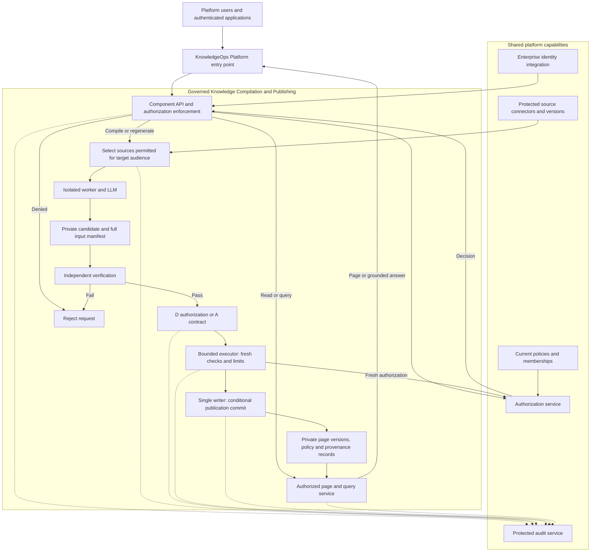

# KnowledgeOps Platform: Governed Knowledge Compilation and Publishing

**Version 4 · Component architecture for review · 28 September 2026**

Governed Knowledge Compilation and Publishing is a component of the KnowledgeOps Platform. It converts approved source material into maintained, linked knowledge pages for defined audiences and manages their review, publication, consultation and revocation. The component gives the platform a persistent, source-grounded knowledge collection that people and authorized applications can reuse.

This document proposes the component's responsibilities, integration boundaries and operating contract. The architecture and integrations require implementation and validation; no deployed platform capability or security assurance is claimed.

## Role within the KnowledgeOps Platform

The component consumes approved source versions and trusted access policies through platform integration interfaces. It produces versioned Markdown pages, source-dependency records and publication events. Platform user interfaces, search services and agent tools can consume published knowledge through authorized APIs.

The proposed integration model reuses shared platform capabilities for identity, policy decisions, private storage, job execution infrastructure, credential custody and protected audit. The component owns the compilation workflow, candidate and page lifecycle, provenance relationships and the sole logical publication writer. Shared infrastructure does not remove its obligation to enforce authorization at every protected operation.

| Boundary | Component responsibility | Shared platform integration |
| --- | --- | --- |
| Source intake | Admit exact source versions whose use is permitted for the intended audience; record the full input manifest. | Source connectors provide protected content, stable identifiers, revisions and authoritative policy references. |
| Identity and authorization | Enforce the trusted execution context at compilation, publication, reading and editing boundaries. | Identity services authenticate principals; policy services provide current authorization decisions and membership data. |
| Knowledge production | Generate private candidates, coordinate independent verification and request authorization of publication. | Model access, bounded execution infrastructure and credential custody support restricted workers. |
| Persistence and publication | Own page revisions, dependencies, publication state and conditional writes. | Private content storage, a protected database and job infrastructure host component records. |
| Consumption | Serve authorized pages and evidence-grounded answers; protect historical versions and exports. | Platform interfaces, search and agent adapters call the same protected APIs. |
| Evidence and operations | Emit attributable attempts, decisions and outcomes; enforce budgets, stop and recovery. | Protected audit, monitoring and operational controls retain evidence and expose failures. |

These are responsibility boundaries, not a requirement to deploy each function as a separate service. Existing platform services may fulfill shared responsibilities if they meet the contract. Missing capabilities must be implemented before the dependent component behavior is enabled.

## Component objective and scope

Users and agents must only receive knowledge authorized for their audience. A document must be protected from its first publication, and every managed read, write and permission change must be attributable.

The component maintains persistent knowledge pages compiled from approved sources. Users browse authorized pages or ask questions grounded in those pages. Its initial design does not require embeddings, a vector database or synthesis from raw-source chunks at query time. Any platform retrieval or answer-generation integration must preserve the same authorization boundary as direct page access.

The component defines how knowledge is prepared, verified, published, maintained and consumed. Selection of the wider platform's search engine, source connector portfolio and user interface is outside this document. Such integrations must preserve page policies, revision references, provenance and revocation behavior.

## Component governance and operating contract

**Governing design reference:** The Agentic Pact **0.2.0**, repository revision `e972664e2b8bfcbc0fcd796b8e7525b999816a3e`. The [C01–C12 controls](https://github.com/bitrockteam/the-agentic-pact/blob/e972664e2b8bfcbc0fcd796b8e7525b999816a3e/docs/controls/README.md) are the governing design baseline; the [operating profiles](https://github.com/bitrockteam/the-agentic-pact/blob/e972664e2b8bfcbc0fcd796b8e7525b999816a3e/docs/profiles/operating-profiles.md) determine the authorization gate for each effect.

**Design requirements:** publication separates independent verification, authorization of the concrete effect and bounded execution. Each page has one accountable writer. Delegated and autonomous operations require explicit authority, protected credentials, enforced budgets, a stop mechanism and recovery for uncertain outcomes. These requirements must be demonstrated by implementation evidence before conformity can be claimed.

Audience-specific compilation and permission inheritance are application requirements. The Pact supplies the agent governance framework; it does not itself implement Markdown confidentiality, role propagation, or source-policy invalidation.

### Profiles and effects

| Component operation | Pact profile | Required gate |
| --- | --- | --- |
| Read or analyze authorized sources and compiled pages; prepare a private draft | L | Authorized assignment and resource access; no implicit publication or external send. |
| Publish or edit a specified shared page on a user's behalf | D | A sufficiently specific human request covering the actual object, content and audience; fresh authorization before the effect. |
| Periodically refresh pages without a person supervising each run | A | A previously approved contract naming owner, trigger, sources, destination audience, allowed operations, limits, expiry and stop path. |
| Develop the component's shared code | C | Branch, PR, required checks on the current result and authorized human merge. |

Compilation jobs may begin in L and transition to D or A for publication. The transition is a new authorization decision. An existing sufficiently specific authorization need not be requested twice. A generic request to summarize does not authorize publishing the generated text to a shared space.

Require explicit human approval for access expansion, sensitive exports, administrative changes, irreversible operations or spending beyond the authorized limit. An A contract cannot authorize the agent to expand its own mandate. Material changes to content, destination or permissions invalidate the affected approval.

### Concrete publication boundary

1. **Prepare:** a compilation worker receives only inputs approved for the destination audience and emits a private candidate. It cannot publish, alter policies or obtain production credentials.
2. **Review:** an independent verifier receives the exact candidate, approved requirements, complete input manifest, relevant dependencies and acceptance criteria. It can reject the candidate. Exploratory content review and acceptance verification are distinct functions; agreement between two models is not evidence of correctness.
3. **Authorize:** the control plane binds a D authorization or applicable A contract to an immutable candidate hash, destination, audience, operation, expected previous version, dependency revisions and validity period. If D authorization does not yet cover the generated content, present that content for approval.
4. **Execute:** a separate bounded executor revalidates the principal, delegation, arguments, policy freshness, approval or mandate, quotas and stop state. It resolves an opaque operation reference into a protected server-side record. User-supplied approval IDs or model-written metadata are not authority.
5. **Commit:** the publication service is the sole logical writer for each page. It enforces an expected-version condition and an idempotency key, and atomically records the new publication reference, provenance and audit outbox event.
6. **Confirm:** check the committed version and publication state through the authoritative service. Record actual outcome separately from the attempt. If the result is uncertain, reconcile using the operation ID before retrying.

The writer can run multiple service replicas, but per-page ownership and database concurrency rules must prevent competing writers from silently overwriting state. Human edits use the same writer path. Concurrent proposals may be reviewed independently; reconciliation has one accountable owner.

A minimal typed executor interface is `publish_document(operation_ref)`, `apply_document_edit(operation_ref)` and `block_document(operation_ref)`. Their protected operation records contain validated resource IDs and immutable artifact references. Arbitrary shell commands, arbitrary URLs, caller-chosen credentials and generic SQL are outside this interface. Policy administration uses a separately authorized operation and principal.

### Identity, secrets and communication

Keep the delegating user, authenticated application, effective workload principal and operation distinct. D uses traceable scoped delegation; A uses a dedicated or federated workload identity. Record credential issuer, intended API recipient, scope, access-token expiry, renewal conditions, grant duration and revocation mechanism separately.

Entra ID or Keycloak authenticates identities; the application still enforces resource and effect authorization. In particular, the OAuth token's `aud` identifies the receiving API, while `target_audience_id` identifies the intended readers of a knowledge artifact. These are different concepts and must not share one overloaded field.

A credential broker or bounded executor owns downstream secrets. Neither the model nor arbitrary code in its worker can read them through environment variables, mounts, neighboring processes, caches, logs or diagnostics. Enforce this with actual process and service boundaries and test the reachable paths.

MCP and A2A are optional adapters. If used, record actual supported versions, transport, extensions and a versioned tool profile. Authenticate and authorize every hop. Obtain a distinct downstream token where needed; never pass an incoming MCP token through as a downstream API credential. An Agent Card, message, tool result, source document or generated Markdown cannot grant authority. Protocol conformance does not establish application authorization, durable audit or verified remote effects.

### Limits, stop and evidence

For each D job or A contract, persist enforced limits for elapsed time, token/cost budget, source and output volume, tool calls, retries and concurrency. Stop or expiry must prevent new tool calls and publication, cancel queued work and terminate running execution where supported. Recheck the stop state at the commit boundary; an already committed effect requires an explicitly authorized recovery action.

Use an isolated worker with bounded filesystem access and network destinations. Protect model, tool, workflow and dependency configuration changes. Do not equate an authenticated endpoint or a valid dependency signature with safe content.

Send audit records to a collector or storage boundary the worker and executor cannot rewrite or delete. Record authorization and approval before high-impact effects. If post-effect recording fails, expose uncertainty and reconcile; do not blindly replay the operation. Keep secrets, private model reasoning and unnecessary sensitive text out of the audit. This component additionally requires managed reads to fail closed when durable audit recording is unavailable. This application requirement extends beyond the Pact's stated high-impact baseline.

### Control-to-implementation mapping

The statuses below concern **implementation assurance** and remain **Unknown**: this proposal provides requirements, not evidence from a deployed system or runtime tests. Each control is mapped to an implementation requirement, the evidence needed to close it and a proposed responsible role. Named owners must be assigned before enablement.

| Control | Required implementation | Evidence needed to close; proposed owner | Status |
| --- | --- | --- | --- |
| C01: Justified complexity | One compilation agent plus deterministic orchestration initially; add agents only with a documented benefit. | Compare quality, end-to-end latency and total cost against the simpler baseline; architecture owner. | Unknown |
| C02: One accountable writer | Sole publication service, per-page ownership, expected versions and defined reconciliation. | Ownership map and conflicting-edit refusal test; knowledge component owner. | Unknown |
| C03: Independent verification | Independent review and acceptance gate over the exact candidate and requirements. | Rejection of defective candidates, recorded findings and current-version test results; verification owner. | Unknown |
| C04: Authority verification | Deny by default at entry, protected reads, tool calls and immediately before publication. | Allowed and refused subjects/resources, revoked delegation and mid-job policy changes; identity/security owner. | Unknown |
| C05: Proposal before commitment | D authorization or A contract bound to the actual effect; C gate for shared service code. | Changed-content/audience refusal, expired authorization and effective publication principal; product/security owner. | Unknown |
| C06: Bounded executor | Separate service with typed operations, no generic credentialed shell or bypass. | Direct-call/bypass refusal, schema validation and uncertain-result reconciliation; platform owner. | Unknown |
| C07: Identity and delegation | Distinct delegator/application/workload, scoped D grants and dedicated A identity. | Effective privileges, renewal/offboarding and revocation tests; identity owner. | Unknown |
| C08: Recipient-scoped credentials | Correct token recipient per hop and distinct downstream credentials; versioned adapters. | Valid, expired, revoked, wrong-audience and incompatible-version tests; integration owner. | Unknown |
| C09: Secrets outside free execution | Broker/executor custody outside model and arbitrary-code reach. | Files, mounts, processes, environment, logs and diagnostic access tests; platform/security owner. | Unknown |
| C10: Content is not authority | Server-controlled permissions, full input provenance and checks on every output channel. | Injection attempts, forged metadata and unauthorized destination/data refusal; application security owner. | Unknown |
| C11: Capability limits and stop | Enforced sandbox, finite quotas, stop/revoke path and idempotent recovery. | Over-limit, queued/running cancellation, replay and timeout tests; platform/SRE owner. | Unknown |
| C12: Observable evidence | Protected collector, attempt/effect correlation, retained approvals and outcome records. | Trace emission, executor deletion refusal, collector outage and reconciliation tests; audit/SRE owner. | Unknown |

Follow the Pact's [measurement method](https://github.com/bitrockteam/the-agentic-pact/blob/e972664e2b8bfcbc0fcd796b8e7525b999816a3e/docs/methodology/measurement.md): each result must include the environment/configuration, expected and observed behavior, dated evidence, limitations, owner and closure action. A documented requirement is not a verified control. Conditional protocol subcriteria may become Not applicable only when the corresponding surface is absent, with a recorded reason and a condition for reassessment.

## Component architecture and platform integration

Use the platform control plane with separate knowledge spaces for explicitly defined security audiences. An audience can be a group, an individual, or a policy-defined combination. Reuse a knowledge space where its audience policy permits; create separate collections only when access requirements require distinct content.

| Function | Responsibility and integration |
| --- | --- |
| Platform identity integration | Authenticate users and workloads through the configured enterprise provider, such as Entra ID or Keycloak. |
| Component API behind the platform entry point | Enforce authentication and authorization on every compilation, publication, page and query operation. |
| Platform authorization service | Evaluate subject, actor, action, resource, tenant and target audience; the component enforces each decision. |
| Protected component records | Store document policies or authoritative policy references, versions, source dependencies and publication state in platform-managed database storage. |
| Platform private content storage | Hold controlled source snapshots and versioned Markdown; prevent direct end-user bypass. |
| Compilation workers | Prepare private audience-specific candidates using restricted inputs and tools. |
| Independent verifier | Evaluate the exact candidate against approved requirements and evidence; may reject publication. |
| Authorization gate and bounded executor | Bind D authorization or an A contract to the effect; enforce fresh checks, limits and stop. |
| Publication service | Sole logical writer per page, with expected versions, idempotency and protected audit. |
| Reader and query service | Serve authorized knowledge pages and generate answers from permitted page versions. |
| Platform audit service | Preserve attributable access, modification and policy-decision records outside the component worker and executor write boundary. |

## Identity, delegation and authorization context

Validate access tokens at the API boundary, including signature, issuer, audience and validity. Resolve stable user and group identifiers through trusted identity data; do not authorize from display names, request parameters or model-generated claims. Group membership and application roles are separate concepts and must be mapped explicitly to permissions.

Maintain a trusted execution context containing tenant, initiating user, executing application or agent, authorized operation, target audience, request ID and job ID where applicable. A delegated agent is limited by both the user's authority and the granted delegation. Autonomous jobs use a separately authorized workload identity and record their configured owner or initiator.

For compatible downstream APIs, Entra's On-Behalf-Of flow obtains a token for the downstream API. It does not make one token valid everywhere, and it does not replace document authorization. For asynchronous execution, store a protected job record and reauthorize at execution and publication; do not rely indefinitely on the initiating token or copied memberships.

## Content compilation and permission inheritance

1. The requester specifies the destination audience and requested operation.
2. The backend verifies permission to create or update content in that destination.
3. The backend admits only sources whose policies permit their use for that audience under the job's authorized identity.
4. The worker receives only admitted content and tools constrained to that scope. Conversation state, temporary files and caches must not carry content across incompatible audiences.
5. The LLM produces a draft. The backend assigns its policy, provenance and version independently of the model.
6. Before publication, independent verification and the applicable D/A authorization gate must pass for the exact candidate. The bounded executor rechecks policy freshness, source dependencies, limits and stop state. Content becomes visible only after the single writer commits its security metadata and audit event.

**Example:** Franco belongs to Pippo and to a more privileged group. A page intended for Pippo must exclude information available only through Franco's additional membership. A source allowed to HR and another allowed to Finance cannot automatically produce a page readable by either group: a combined page must satisfy both source policies, or separate pages must be compiled from appropriately restricted inputs.

Use explicit audience policies rather than assuming roles form a simple privilege hierarchy. An LLM-generated summary does not automatically qualify for declassification. Any broader release requires a separately authorized review process.

## Component records, provenance and storage

Each document version records `document_id`, `tenant_id`, `space_id`, `policy_id`, `policy_version`, `source_versions`, `requested_by`, `executed_by`, `request_id`, `content_hash` and `publication_state`.

The component owns these records in a protected database, using the platform storage boundary. Source content and source permissions retain their designated upstream authorities; generated page revisions, dependency relationships and publication state are authoritative component records. Markdown frontmatter may mirror selected fields for convenience, but editing frontmatter must not grant access. Keep source dependencies at page level initially; finer-grained provenance can follow if needed.

A relational database such as PostgreSQL, private object storage and a job queue are a practical starting point. Reuse platform-managed infrastructure where it satisfies isolation, authorization and audit requirements. Store immutable content objects first, then publish their references, metadata and an audit outbox event in one database transaction. Orphaned unpublished objects remain inaccessible and can be cleaned up.

## Reading, editing and audit

The same component authorization contract protects browsing, agent tools, indexes, backlinks, previews, citations, exports and queries, including calls made through other platform interfaces. Read and write are distinct permissions. Manual edits create new versions; agent edits also pass through the restricted compilation workflow. Use version preconditions to prevent silent overwrites.

Audit events include initiator, actor, delegation reference, timestamp, action, target, authorization decision and policy version, source or document versions, and outcome. Write events retain before/after version references and attributable changes. Record served content separately from requested content, and include denials. A delivery log establishes what the service returned, not whether a person actually read it.

Audit persistence is a required service dependency: define fail-closed behavior when durable recording is unavailable. Keep tokens and credentials out of logs. Protect audit access and export events to a tamper-resistant retention system; Git history alone does not record reads.

## Revocation and operational boundaries

Membership changes must invalidate or refresh authorization caches within a defined revocation target. Source-policy changes invalidate affected derived pages until their permissions are re-evaluated or their content is regenerated. Enforce freshness checks at read time so a delayed background job cannot silently keep stale pages available.

Apply the same isolation to model sessions, caches, logs and tool credentials. A controlled compilation context reduces unauthorized disclosure paths; it does not establish a universal guarantee against implementation defects, compromised infrastructure or information independently known to a model.

Downloaded plaintext cannot remain subject to API access checks or comprehensive read auditing. If continuing control is mandatory, restrict exports and keep consultation within the managed service.

## Component deployment options and implementation stages

| Option | Advantage | Trade-off |
| --- | --- | --- |
| Audience-specific spaces: recommended baseline | Clear boundaries and straightforward compilation rules. | Duplicate pages and recompilation across audiences. |
| Shared knowledge space with per-page policies | Less duplication and more flexible sharing. | More complex dependency, query and revocation behavior. |
| Separate deployments per security domain | Stronger infrastructure isolation. | Higher operational cost and limited cross-domain synthesis. |

Begin by integrating one platform identity provider and two distinct security audiences, with protected source ingestion, L-profile private compilation, a supervised D publication gate, an independent verifier, the bounded single writer, versioned reads and edits, revocation enforcement and protected audit. Add unattended refresh only after its A contract, workload identity, enforced budgets, stop path and recovery tests are in place. Any asynchronous job must reauthorize at execution and publication from its first release. Production acceptance should verify cross-audience isolation, direct-object access denial, prompt-injection attempts against tools, cache isolation, mid-job revocation, audit outages and concurrent edits.

Before implementation, component and platform owners must agree on audience granularity, source-policy authority, the revocation target, audit retention, export rules and the model hosting boundary. These choices determine the achievable security and operational guarantees.

## Primary references

- [Microsoft: Claims validation](https://learn.microsoft.com/en-us/entra/identity-platform/claims-validation): API token and authorization checks.
- [Microsoft: On-Behalf-Of flow](https://learn.microsoft.com/en-us/entra/identity-platform/v2-oauth2-on-behalf-of-flow): delegated API access.
- [Keycloak: Authorization Services](https://www.keycloak.org/docs/latest/authorization_services/index.html): resource policies, decision points and enforcement.

Audience partitioning, publication, provenance and audit are responsibilities of the application services. Each requires implementation and validation against the technical contract below.

## Component integration and implementation contract

### Policy composition

Let `Readers(x, t)` be the principals permitted to read resource `x` at time `t`. For a derived document `d` generated from inputs `s1 ... sn`, the default confidentiality invariant is:

`Readers(d, t) ⊆ Readers(s1, t) ∩ ... ∩ Readers(sn, t)`

Creation also requires the caller or workload to have source-use authority and destination-write authority. Reader-set containment is necessary but not sufficient where a source has additional purpose, residency, export or processing restrictions.

The invariant concerns policy predicates, not a snapshot of individual group members. Do not implement it by intersecting arrays of group names: `memberOf(HR) AND memberOf(Finance)` differs from `memberOf(HR) OR memberOf(Finance)`. Preserve deny rules and contextual conditions. Initially support a bounded, explicit policy language; reject publication if audience compatibility cannot be established.

Track every input available to a generation, including user attachments, instructions containing business data, prior knowledge-page versions and tool results. Model citations are not reliable evidence that uncited inputs had no influence. Use the full execution manifest as conservative provenance. A supplied prompt containing confidential material is also an input; moving to a broader audience requires clearing incompatible session history or a separately authorized release.

### Illustrative component API surface

| Endpoint | Enforced operation |
| --- | --- |
| `POST /spaces/{spaceId}/compile-jobs` | Authorize source use, compilation and destination audience. |
| `GET /jobs/{jobId}` | Protect job status and metadata; expose no cross-audience source titles. |
| `GET /documents/{documentId}` | Authorize the current published version before delivery. |
| `GET /documents/{documentId}/versions/{version}` | Reauthorize historical content; previous publication is not perpetual permission. |
| `PATCH /documents/{documentId}` | Authorize write and enforce an expected-version precondition. |
| `POST /spaces/{spaceId}/queries` | Use only permitted compiled pages and compatible conversation state. |
| `POST /documents/{documentId}/policy-changes` | Require separate policy-administration authority. |
| `GET /audit/events` | Require scoped auditor authority. |

These endpoint paths describe the component contract; they may be exposed beneath a platform API prefix. All identifiers are resolved within the authenticated tenant. Audience IDs select a requested target; they never prove membership. A UI or MCP adapter calls these APIs and cannot bypass them. Agents get narrowly scoped tools; unrestricted repository mounts, shell access and storage credentials are outside the baseline execution profile.

### Publication consistency

Use a lifecycle such as `draft → independently_verified → authorized → published → stale/blocked → superseded`. Validation includes authorization and schema checks; it does not certify factual correctness.

Pin source versions and record the observed policy revision for each dependency. Immediately before publishing, check that all revisions remain valid. Commit the new document version, dependency edges, publication pointer and audit outbox entry transactionally, with concurrency protection against local policy changes. If content lives in object storage, upload it privately first and publish only the database reference after the commit.

An external identity provider or source ACL system cannot be made atomic merely by wrapping local database writes in a transaction. Define authoritative checks, change propagation and a maximum accepted freshness window. Recheck at serving boundaries and block if required policy freshness cannot be established. Strict immediate revocation requires a coordinated authoritative decision path; webhook delivery alone is not such a guarantee.

### Read audit and response integrity

Before releasing content, durably record an authorized delivery attempt with document version references. Record completion or failure separately; do not treat an attempted or server-completed response as proof of human consumption. Persist query response artifacts when exact reconstruction is required, encrypt them, apply their derived policies and impose explicit retention. A response hash alone cannot reproduce the text.

Write events and outbox events are committed together; delivery to the audit sink is retryable and deduplicated by event ID. Partition and restrict audit access because document titles, prompts and diffs may themselves be sensitive. Configure behavior when the durable journal is unavailable and monitor backlog and retention enforcement.

### Acceptance criteria

Verify that a Pippo session cannot access restricted source text through generation, query, tools, cached results, historical versions, attachments, indexes or logs. Test Franco's simultaneous membership in Pippo and a privileged group; removing that membership while a compilation job is queued or running; source-policy changes between validation and publication; forged audience parameters; direct object identifiers; and a prompt-injected model attempting unauthorized tool calls.

Separate authorization correctness from content quality: source attribution, contradictory claims and unsupported answers need independent evaluation. Correct access control does not establish the factual accuracy of the published knowledge.

Additional implementation references: [OWASP Authorization Cheat Sheet](https://cheatsheetseries.owasp.org/cheatsheets/Authorization_Cheat_Sheet.html) and [OWASP Logging Cheat Sheet](https://cheatsheetseries.owasp.org/cheatsheets/Logging_Cheat_Sheet.html).
